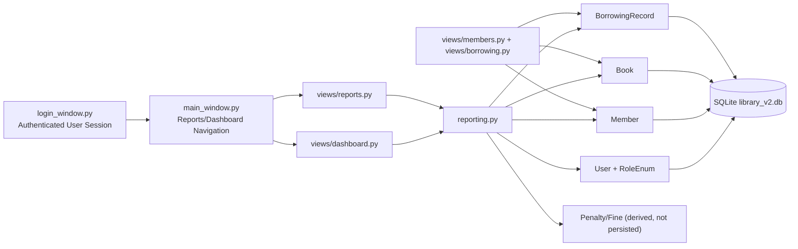
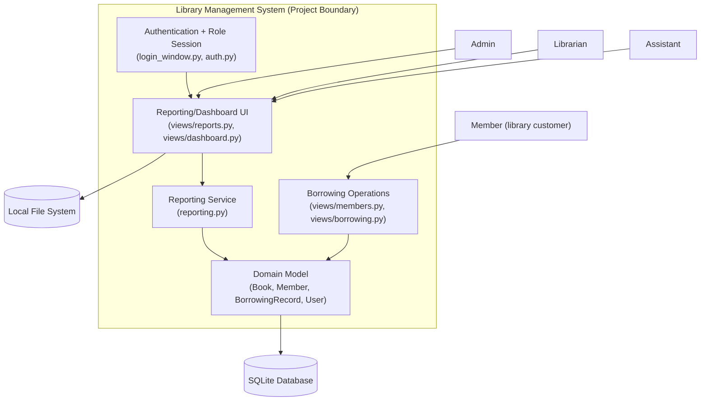
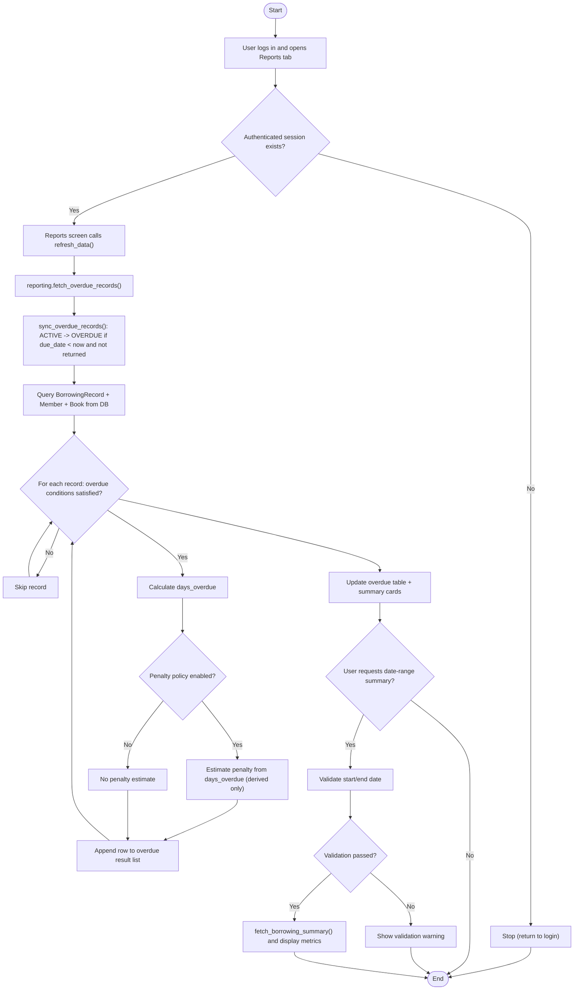

# Sprint 3 System Models

This document captures the Sprint 3 modeling/presentation view for reporting and dashboard features, especially overdue books reporting.

## 1. Connected with Main System

Sprint 3 reporting is not a standalone feature. It depends on existing modules:

- `main_window.py`: integrates `Reports` and `Dashboard` tabs into the main system
- `views/reports.py`: overdue reporting screen and summary generation
- `views/dashboard.py`: dashboard cards and overdue preview
- `reporting.py`: reporting service layer (queries + overdue classification + derived penalty estimate)
- `views/members.py` and `views/borrowing.py`: create/update borrowing lifecycle data
- `models.py`: `Book`, `BorrowingRecord`, `Member`, `User`, `RoleEnum`
- `database.py` / `library_v2.db`: persistence layer

### Notes

- Overdue state is synchronized from real borrowing data (`due_date`, `return_date`, `status`).
- Fine/Penalty is modeled as a derived value from `days_overdue` (presentation/reporting level); there is currently no dedicated fine table.

## 2. Context / External System Model

System boundary and external interactions for Sprint 3 reporting:

### Boundary Clarification

- **Inside boundary:** UI modules, reporting service, domain models, and SQLite access.
- **Outside boundary:** human actors (`Admin`, `Librarian`, `Assistant`, `Member`) and local file system as external storage surface.

## 3. Selected Model: Activity Diagram (Overdue Books Reporting)

### Implementation Mapping

- Activity nodes `D/E/F/G/N` map directly to `views/reports.py` and `reporting.py`.
- Data sources in `G` map to `BorrowingRecord`, `Book`, and `Member` entities in `models.py`.
- Authentication/role context in `B/C` maps to existing login + session flow (`login_window.py`, `main.py`, `main_window.py`).
